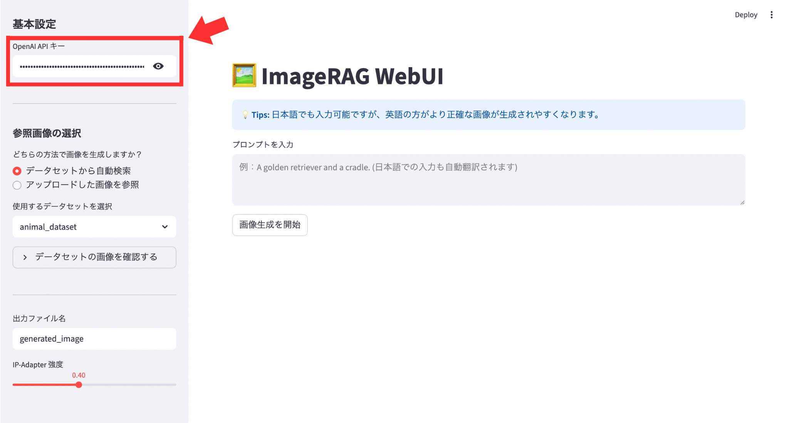

[英語版](https://github.com/ootani2015/imagerag-webui/blob/main/README.md)

<h1 align="center">ImageRAG WebUI</h1>

## 概要
ImageRAG WebUIは、オリジナルの [ImageRAG](https://github.com/rotem-shalev/ImageRAG) をベースに、Stable Diffusion XL (SDXL) と RAG (Retrieval-Augmented Generation) の仕組みを組み合わせ、実用性と操作性を高めるための機能拡張および WebUI (Streamlit) の実装を行った画像生成アプリです。

本プロジェクトでは、元々 NVIDIA GPU (Linux) 環境を前提として設計されていた ImageRAG を、MPS (Metal Performance Shaders) への対応や、独自のメモリ管理ロジック（VRAM解放処理）を組み込むことで、Apple Silicon (M1/M2 Mac) 環境でも動作するように最適化させました。

## セットアップ
まずは、ImageRAG_WebUI環境を構築します。
```
conda env create -f environment.yml
conda activate ImageRAG_WebUI
```
次に、datasets フォルダを作成し、その中に画像フォルダ（Tokyo_dataset、animal_datasetなど）を配置してください。
```
project/
├── datasets/
│   ├── Tokyo_dataset/
│   │   ├── bridge_01.jpg
│   │   └── bridge_02.jpg
│   └── Animal_dataset/
└── imageRAG_UI.py
```
また、プロンプトの最適化と画像内容の判定に **OpenAI APIキー** を使用するので、用意してください。

## 使い方
① ImageRAG_WebUI環境をアクティブになっている状態で、以下のコマンドを実行してアプリを起動します。
```
streamlit run imageRAG_UI.py
```
ローカル上でSDXLを動かすのが難しい場合は、以下のコマンドを実行してアプリを起動してください。

システムによる強制終了の閾値が緩和され、最後まで生成が走りやすくなります。
```
export PYTORCH_MPS_HIGH_WATERMARK_RATIO=0.0
streamlit run ImageRAG_UI.py
````
② アプリの画面に移動したら、サイドバーで Open APIキー を入力します。



③ 参照ソース（データセット or アップロード画像）を選択します。

既存の画像集からAIに探させたい場合（データセット）


本プロジェクトは ImageRAG を基にしており、Rei Otani（2025）によって改変および拡張が加えられています。本リポジトリが有用であると感じられた場合は、ImageRAG の論文を引用してください。:
```
@article{shalev2025imagerag,
  title={Imagerag: Dynamic image retrieval for reference-guided image generation},
  author={Shalev-Arkushin, Rotem and Gal, Rinon and Bermano, Amit H and Fried, Ohad},
  journal={arXiv preprint arXiv:2502.09411},
  year={2025}
}
```
