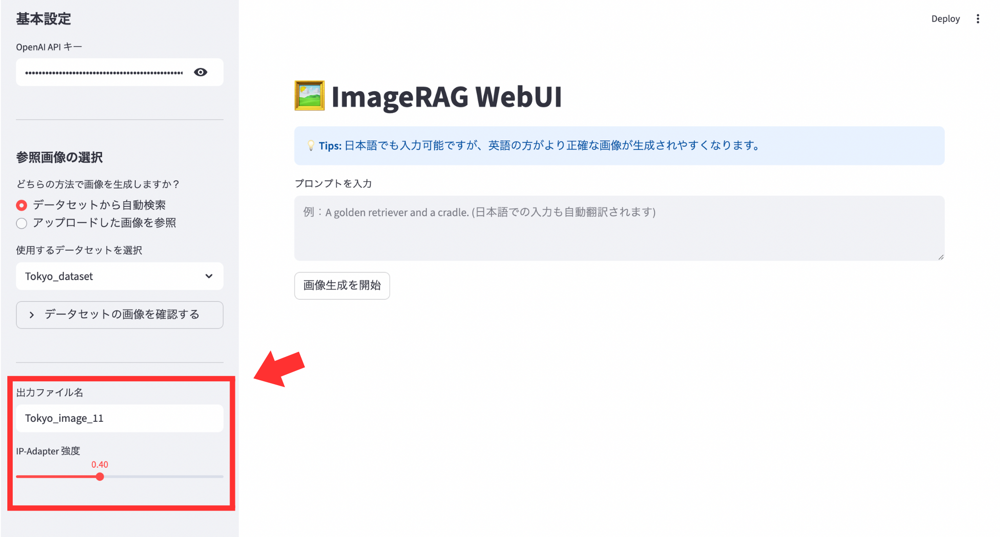
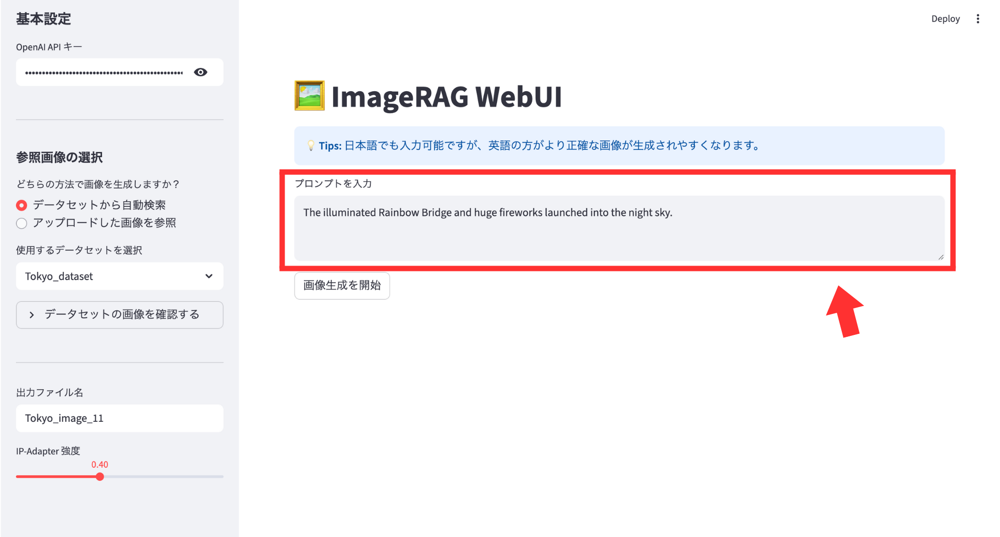
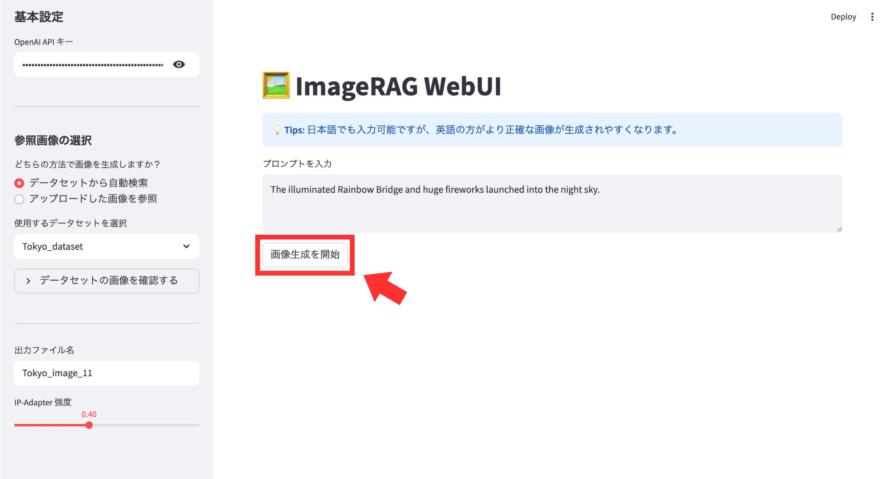
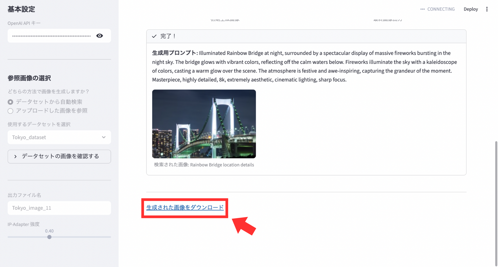

[英語版](https://github.com/ootani2015/imagerag-webui/blob/main/README.md)

<h1 align="center">ImageRAG WebUI</h1>

## 概要
ImageRAG WebUIは、オリジナルの [ImageRAG](https://github.com/rotem-shalev/ImageRAG) をベースに、Stable Diffusion XL (SDXL) と RAG (Retrieval-Augmented Generation) の仕組みを組み合わせ、実用性と操作性を高めるための機能拡張および WebUI (Streamlit) の実装を行った画像生成アプリです。

本プロジェクトでは、元々 NVIDIA GPU (Linux) 環境を前提として設計されていた ImageRAG を、MPS (Metal Performance Shaders) への対応や、独自のメモリ管理ロジック（VRAM解放処理）を組み込むことで、Apple Silicon (M1/M2 Mac) 環境でも動作するように最適化させました。

## セットアップ
まずは、ImageRAG_WebUI環境を構築します。
```
conda env create -f environment.yml
conda activate ImageRAG_WebUI
```
次に、datasets フォルダを作成し、その中に画像フォルダ（Tokyo_dataset、animal_datasetなど）を配置してください。
```
project/
├── datasets/
│   ├── Tokyo_dataset/
│   │   ├── bridge_01.jpg
│   │   └── bridge_02.jpg
│   └── Animal_dataset/
└── imageRAG_UI.py
```
また、プロンプトの最適化と画像内容の判定に **OpenAI APIキー** を使用するので、用意してください。

## 使い方
#### ① ImageRAG_WebUI環境をアクティブになっている状態で、以下のコマンドを実行してアプリを起動します。
```
streamlit run imageRAG_UI.py
```
ローカル上でSDXLを動かすのが難しい場合は、以下のコマンドを実行してアプリを起動してください。

システムによる強制終了の閾値が緩和され、最後まで生成が走りやすくなります。
```
export PYTORCH_MPS_HIGH_WATERMARK_RATIO=0.0
streamlit run ImageRAG_UI.py
```
#### ② アプリの画面に移動したら、サイドバーで Open APIキー を入力します。


#### ③ サイドバーで参照ソース（データセット or アップロード画像）を選択します。
・既存の画像集からAIに探させたい場合（データセット）


データセット内にある画像は「データセット内にある画像を確認する」を押すと確認することができます。

・特定の要素を確実に反映させたい場合（アップロード画像）


#### ④ サイドバーで出力されるファイル名を入力し、IP-Adapter強度を調整します。
IP-Adapter強度を調整することで、参照画像の反映具合をコントロールできます。


**⚠️ 注意点**：強度を 1.0 に設定すると、画像が崩れたり、プロンプトの指示が全く反映されなくなったりすることがあります。基本的には 0.4 前後から微調整を始めるのが、最も効率的に高品質な画像を得るコツです。

#### ⑤ プロンプトを入力します。（推奨：英語）
モデルがネイティブに理解できるため、英語でプロンプト入力した方が、細かなニュアンスや構図の指示が正確に反映されます。

自動翻訳により日本語でもプロンプト入力可能ですが、抽象的な表現や日本固有の単語は、翻訳プロセスで意図が変わってしまう場合があります。



#### ⑥「画像生成を開始」を押して画像生成を開始します。

**⚠️ 注意点**：画像生成には、約20分ほど時間が掛かります。（初期画像生成に約5分、最終画像生成に約15分）

#### ⑦ 画像生成完了
**ステップ1：初期画像の表示（約5分後）** 生成開始から約5分ほど経過すると、画面左側に 「初期生成画像」 が表示されます。この段階で、AIが入力されたプロンプトをどのように解釈したかを確認できます。

**ステップ2〜3：AIによる判定と検索** 初期画像を表示した後、バックグラウンドでAIが内容の不足を判定し、最適な参照画像をデータセットから検索します。この間、画面は更新されませんが、プロセスは正常に進行しています。

**ステップ4：最終画像の出力（さらに約15分後 / 合計約20分）** 画像生成開始から合計して約15分ほど経過すると、画面右側に「最終画像出力」が表示されます。これがIP-Adapterによって参照画像のディテールが合成された最終結果です。


※ 画面下部のステータスバーが「完了！」に変わるまでブラウザを閉じずにお待ちください。

#### ⑧ 画像をダウンロード




## 引用
本プロジェクトは ImageRAG を基にしており、Rei Otani（2025）によって改変および拡張が加えられています。本リポジトリが有用であると感じられた場合は、ImageRAG の論文を引用してください。:
```
@article{shalev2025imagerag,
  title={Imagerag: Dynamic image retrieval for reference-guided image generation},
  author={Shalev-Arkushin, Rotem and Gal, Rinon and Bermano, Amit H and Fried, Ohad},
  journal={arXiv preprint arXiv:2502.09411},
  year={2025}
}
```
