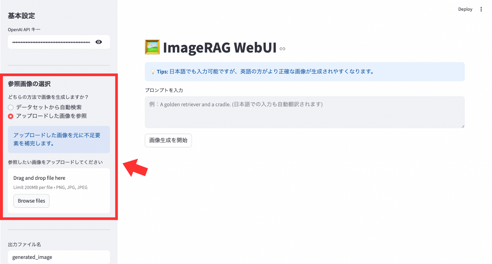

[Japanese version](https://github.com/ootani2015/imagerag-webui/blob/main/README-ja.md)

<h1 align="center">ImageRAG WebUI</h1>

## Overview
ImageRAG WebUI is an enhanced image generation application built upon the original [ImageRAG](https://github.com/rotem-shalev/ImageRAG) framework. This version integrates Stable Diffusion XL (SDXL) with a Retrieval-Augmented Generation (RAG) workflow and features a user-friendly Web interface (Streamlit) for improved accessibility and functionality.

Originally designed for NVIDIA GPU (Linux) environments, this project has been optimized for Apple Silicon (M1/M2/M3 Mac). It includes support for MPS (Metal Performance Shaders) and custom memory management logic (VRAM clearing) to ensure stable execution on Mac devices.
## Setup
First, clone the repository and navigate to the project directory:
```
git clone https://github.com/ootani2015/imagerag-webui
cd imagerag-webui
```
Next, create and activate the imagerag-webui environment using Conda:
```
conda env create -f environment.yml
conda activate imagerag-webui
```
Create a datasets folder and place your image directories (e.g., Tokyo_dataset, animal_dataset) inside it as follows:
```
project/
├── datasets/
│   ├── Tokyo_dataset/
│   │   ├── bridge_01.jpg
│   │   └── bridge_02.jpg
│   └── Animal_dataset/
└── imageRAG_UI.py
```
Note: An **OpenAI API Key** is required for prompt optimization and image content evaluation.
## How to Use
### [1] Launch the App
With the imagerag-webui environment active, run the following command:
```
streamlit run imageRAG_UI.py
```
If you experience performance issues on Mac, use the following command to relax memory limits and improve stability:
```
export PYTORCH_MPS_HIGH_WATERMARK_RATIO=0.0
streamlit run imageRAG_UI.py
```
### [2] Enter OpenAI API Key
Once the app opens, enter your OpenAI API key in the sidebar.


### [3] Select Reference Source
Choose between a pre-defined dataset or an uploaded image in the sidebar.
#### Dataset Search: AI automatically finds the most relevant reference images from your specified dataset folder.

You can check the images in the dataset by clicking "Check images in the dataset."
#### Manual Upload: Directly provide a specific image you want the AI to reference.
Click "Browse files" to select the image you want to reference.

### [4] Output file name & IP-Adapter adjustmenn
Enter the output file name in the sidebar and adjust the IP-Adapter strength.

By adjusting the IP-Adapter strength, you can control how well the reference image is reflected.


**Tip**: A strength of around 0.4 is recommended for the best balance between prompt adherence and reference image detail. Setting it to 1.0 may lead to image distortion.
### [5] Input Prompt
Enter your prompt in the text area.(Recommended: English)

**Note**: While Japanese input is supported via automatic translation, providing prompts in English is recommended for more precise control over composition and style.

### [6]Start Image Generation
Click "Start Image Generation" to begin image generation.


**⚠️ Important**: The process takes approximately 20 minutes on Apple Silicon (approx. 5 mins for the initial image and 15 mins for the final RAG-enhanced output).
### [7]Image Generation Completed
**Step 1: Displaying the initial image (after about 5 minutes)** After about 5 minutes have passed since the start of generation, the "initial generated image" will be displayed on the left side of the screen. At this stage, you can see how the AI ​​interpreted the input prompts.

**Steps 2~3: AI Judgment and Search** After displaying the initial image, AI will judge the content gaps in the background and search the dataset for the most suitable reference image. During this time, the screen will not be updated, but the process is proceeding normally.

**Step 4: Final image output (after another 15 minutes / total 20 minutes)** After a total of about 15 minutes has passed since the start of image generation, "Final image output" will be displayed on the right side of the screen. This is the final result after the IP-Adapter has combined the details of the reference image.


Please wait until the status bar shows "Complete!" before closing the browser.
### [8] Download Image
If you scroll down to the bottom of the app screen, you will see a link button that says "Download generated image." Clicking this button will download the generated image via your browser.

The file name will be the name you specify in the "Output file name" field on the sidebar.


You can also right-click any displayed image to save it individually.
## Acknowledgements
The author would like to express sincere gratitude to Rotem Shalev-Arkushin and the authors of ImageRAG for their valuable research and for their kind guidance regarding licensing and attribution.

## Citation
This project is based on [ImageRAG](https://github.com/rotem-shalev/ImageRAG) with modifications and extensions developed by Rei Otani, 2025.
If you find this repository useful, please cite the ImageRAG paper:
```
@article{shalev2025imagerag,
  title={Imagerag: Dynamic image retrieval for reference-guided image generation},
  author={Shalev-Arkushin, Rotem and Gal, Rinon and Bermano, Amit H and Fried, Ohad},
  journal={arXiv preprint arXiv:2502.09411},
  year={2025}
}
```

